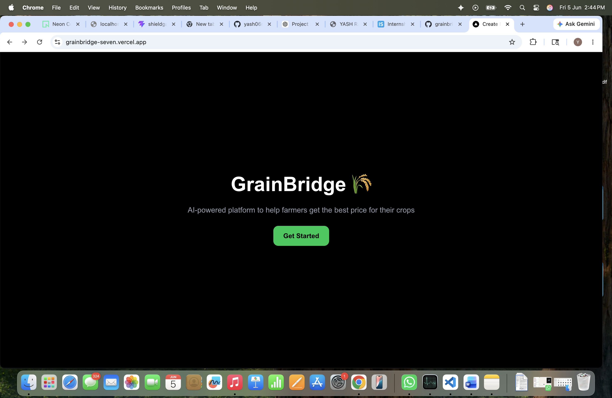
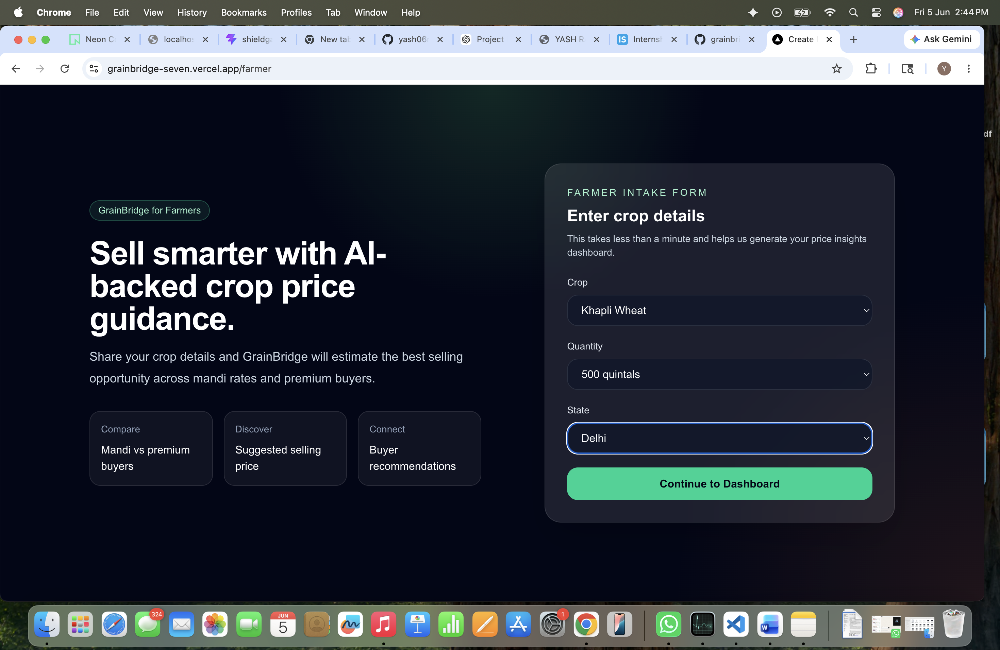
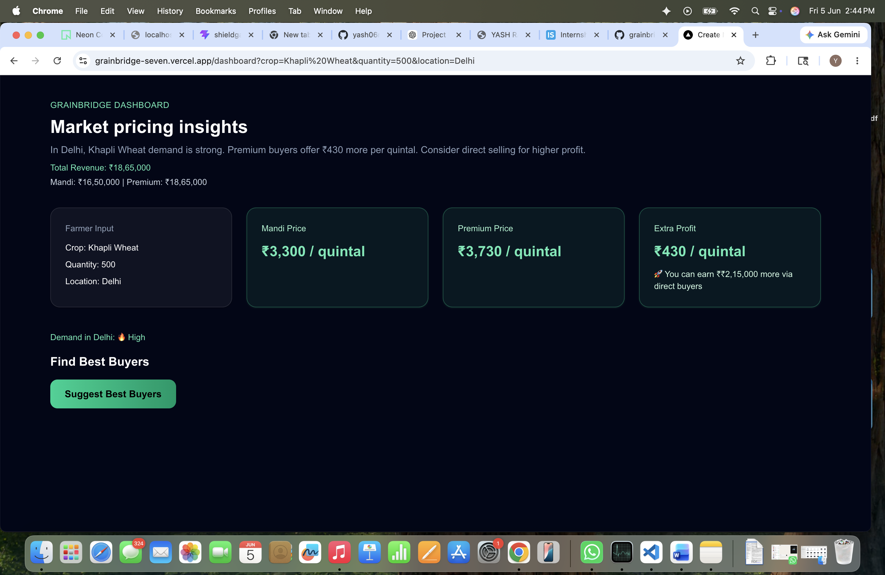
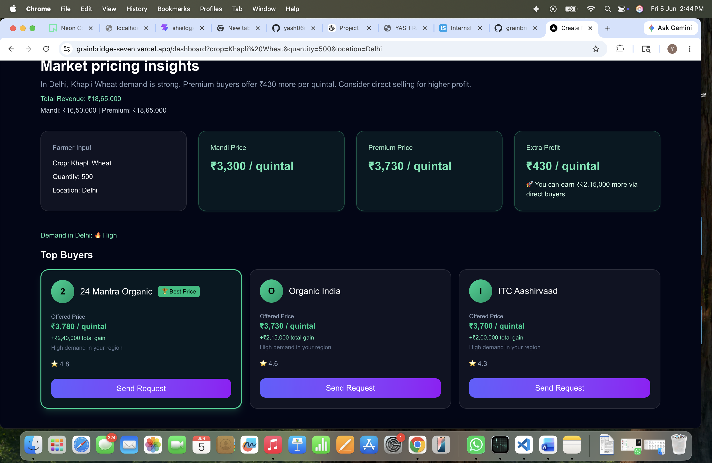
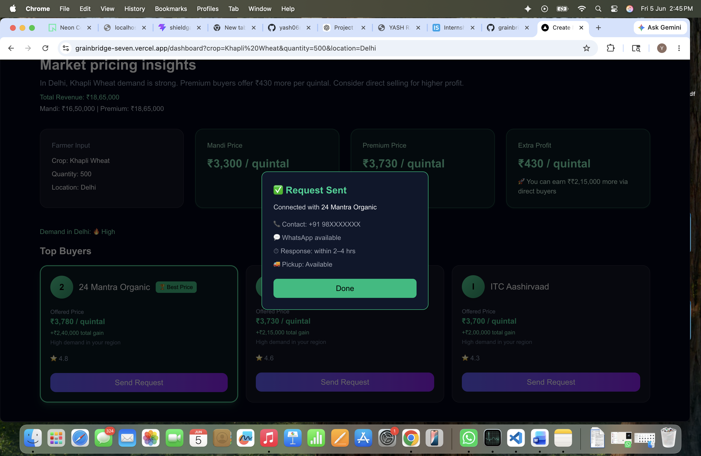

# 🌾 GrainBridge

AI-powered crop pricing and buyer discovery platform designed to help farmers maximize profits by connecting them with premium buyers and providing market intelligence.

---

## 🚀 Live Demo

**Live Application:** https://grainbridge-seven.vercel.app

**GitHub Repository:** https://github.com/yash06rajput/grainbridge

---

# 📖 Overview

GrainBridge is an agricultural marketplace MVP that helps farmers make better selling decisions through market insights, price comparisons, and direct buyer recommendations.

Instead of relying solely on local mandi prices, farmers can compare premium buyer offers, estimate additional profits, and connect directly with buyers.

---

# ❗ Problem Statement

Farmers often face:

- Lack of pricing transparency
- Dependence on intermediaries
- Limited access to premium buyers
- Difficulty identifying the most profitable selling channel

As a result, they may sell produce below its actual market value.

---

# 💡 Solution

GrainBridge provides:

✅ AI-assisted pricing insights

✅ Mandi vs Premium Buyer comparison

✅ Revenue and profit estimation

✅ Buyer recommendations

✅ Direct lead generation

✅ Farmer-friendly onboarding workflow

---

# 🔄 User Flow

```text
Landing Page
     ↓
Farmer Intake Form
     ↓
Crop Selection
     ↓
Quantity & Location Input
     ↓
Market Analysis Dashboard
     ↓
Price Comparison
     ↓
Buyer Recommendations
     ↓
Lead Generation
```

---

# 📸 Screenshots

## 1️⃣ Landing Page



The entry point of GrainBridge introducing the platform's mission and value proposition.

---

## 2️⃣ Farmer Intake Form



Farmers provide:

- Crop Type
- Quantity
- State / Location

This information is used to generate market insights and buyer recommendations.

---

## 3️⃣ Market Pricing Dashboard



The dashboard provides:

- Total Revenue Estimation
- Mandi Price Analysis
- Premium Buyer Pricing
- Additional Profit Opportunities

Helping farmers make data-driven selling decisions.

---

## 4️⃣ Buyer Recommendation Engine



GrainBridge identifies potential buyers based on:

- Offered Price
- Market Demand
- Potential Profit

This enables farmers to discover better selling opportunities.

---

## 5️⃣ Lead Generation Workflow



Farmers can directly connect with buyers and receive:

- Contact Information
- WhatsApp Availability
- Estimated Response Time
- Pickup Availability

---

# ✨ Features

### 🌾 Crop Intelligence

Generate crop-specific market insights based on location and quantity.

### 📊 Price Comparison

Compare:

- Traditional Mandi Rates
- Premium Buyer Offers

### 💰 Profit Estimation

Calculate:

- Expected Revenue
- Additional Earnings
- Best Selling Option

### 🤝 Buyer Discovery

Find high-value buyers offering competitive prices.

### 📞 Direct Lead Generation

Connect farmers directly with potential buyers.

### ⚡ Responsive Interface

Fast and modern UI built with Next.js and Tailwind CSS.

---

# 🛠️ Tech Stack

## Frontend

- Next.js
- React
- TypeScript
- Tailwind CSS

## Deployment

- Vercel

## Planned Backend

- Node.js / Express
- PostgreSQL
- Prisma ORM
- AI-powered recommendation services

---

# 🎯 Future Roadmap

## Phase 1 (Current MVP)

- Farmer onboarding
- Market insights
- Buyer recommendations
- Lead generation workflow

## Phase 2

- Authentication
- Database integration
- Real buyer onboarding
- Dynamic pricing engine

## Phase 3

- AI demand forecasting
- Logistics integration
- Payment gateway
- Mobile application

---

# 🌍 Vision

To build India's most trusted AI-powered agricultural marketplace where farmers can make informed selling decisions, discover premium buyers, and increase profitability through technology.

---

# 👨‍💻 Author

**Yash Rajput**

- GitHub: https://github.com/yash06rajput
- LinkedIn: https://linkedin.com/in/yashrajput06

---

## ⭐ Support

If you like this project, consider giving it a star on GitHub.